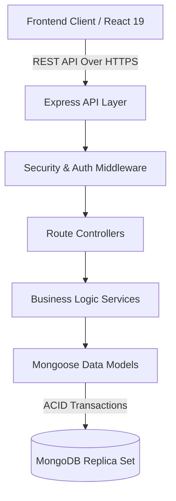

# SortMyScene Ticket Booking Platform

---

## 1. Project Overview

**Problem Statement:**
Managing high-demand event ticketing is notoriously difficult due to race conditions (double bookings), unfair seat hoarding, and complex authentication flows. 

**Business Goal:**
SortMyScene aims to provide a seamless, highly concurrent, and reliable event ticket booking platform that guarantees ACID properties for seat reservations while maintaining a pristine and responsive user experience.

**User Journey:**
1. A user browses the public event catalog (paginated).
2. The user views event details and visually selects available seats from an interactive grid.
3. The user reserves seats, which starts a strict 10-minute countdown timer.
4. The user completes the booking process before the timer expires.
5. If the timer expires or the user cancels, the seats are instantly released back to the public pool.

**Core Features:**
* High-concurrency seat reservation engine.
* 10-minute distributed reservation expiry.
* Real-time double-booking prevention using MongoDB atomic operations & transactions.
* Secure JWT-based authentication.
* Role-based access control (Admin vs User).

*[Live Demo](https://event-ticket-booking-system-one.vercel.app/)*

---

## 2. Features

### Authentication
* **Register:** Secure user registration with bcrypt password hashing.
* **Login:** JWT-based login with HTTP-only cookie support (if configured) or localStorage.
* **JWT Authentication:** Stateful user session validation.
* **Protected Routes:** Frontend and Backend route protection guarding sensitive endpoints.

### Events
* **Event Listing:** Paginated, highly-performant event discovery.
* **Event Details:** Deep-dive into event metadata, time, and location.
* **Seat Availability:** Real-time reflection of seat states (`AVAILABLE`, `LOCKED`, `BOOKED`).

### Reservations
* **Seat Selection:** Interactive UI for selecting up to 8 seats per transaction.
* **Reservation Timer:** Strict server-authoritative 10-minute reservation countdown.
* **Reservation Expiry:** Automated TTL and lazy-cleanup mechanisms for expired reservations.

### Bookings
* **Confirm Booking:** Atomic conversion of a `LOCKED` reservation to a `BOOKED` state.
* **Booking Reference Generation:** Unique, cryptographically secure booking references.

### Security
* **JWT Protection:** Standardized Bearer token authorization.
* **Rate Limiting:** Global rate limiting to prevent brute-force and DDoS attacks.
* **Input Validation:** Strict runtime type-checking and validation using Zod (Backend) and React Hook Form + Zod (Frontend).
* **MongoDB Injection Protection:** Payload sanitization to prevent NoSQL injection.

### UI/UX
* **Responsive Design:** Mobile-first approach using Tailwind CSS.
* **Loading Skeletons:** Optimized perceived performance.
* **Error Handling:** Centralized API error handling mapped to user-friendly UI feedback.
* **Toast Notifications:** Non-intrusive feedback for user actions.

---

## 3. Tech Stack

**Backend**
* Node.js (v20)
* Express.js
* TypeScript
* MongoDB (Replica Set) & Mongoose
* JWT (JSON Web Tokens)
* bcrypt
* Zod (Validation)
* Winston (Logging)

**Frontend**
* React 19
* TypeScript
* Vite
* shadcn/ui (Radix Primitives)
* Tailwind CSS
* Axios
* TanStack Query (React Query)
* React Hook Form
* Zod

---

## 4. System Architecture



**Responsibilities:**
* **Frontend:** Handles user interaction, state management (TanStack Query), form validation, and routing.
* **API Layer / Express:** Manages routing, rate limiting, helmet security headers, and request sanitization.
* **Controllers:** Handles HTTP request/response lifecycles, extracting DTOs.
* **Services:** Pure business logic. Orchestrates transactions, manages concurrency, and enforces domain rules.
* **MongoDB:** The persistent data store running in a Replica Set to enable multi-document ACID transactions.

---

## 5. Folder Structure

### Backend (`/backend`)
* `src/controllers/`: Orchestrates the HTTP request/response flow. Keeps logic thin by delegating to services.
* `src/services/`: Contains the core business rules (e.g., `ReservationService.ts` handles complex concurrency and locking).
* `src/middlewares/`: Express middlewares for cross-cutting concerns (Auth, Error Handling, Rate Limiting).
* `src/models/`: Mongoose schemas and interface definitions.
* `src/validators/`: Zod schemas for strict runtime payload validation.

### Frontend (`/frontend`)
* `src/components/`: Reusable React components (UI elements, layout wrappers).
* `src/hooks/`: Custom React hooks encompassing complex frontend logic.
* `src/api/`: Axios instances and API route definitions. Keeps components decoupled from the network layer.
* `src/query/`: TanStack Query hooks for server-state management (caching, invalidation).
* `src/pages/`: Top-level route components representing full views.

---

## 6. Prerequisites

* **Node.js 18+** (Node 20 recommended)
* **npm**
* **MongoDB Replica Set:** *Critical Requirement.* MongoDB must be running in Replica Set mode (e.g., `rs0`) because the seat reservation engine relies heavily on **Multi-Document ACID Transactions**, which MongoDB does not support in standalone mode.
* **Git**

---

## 7. Environment Variables

### Backend (`.env`)
* `MONGODB_URI`: Connection string to the MongoDB Replica Set. (e.g. `mongodb://localhost:27017/db?replicaSet=rs0`)
* `JWT_SECRET`: Cryptographically secure secret for signing access tokens.
* `JWT_EXPIRES_IN`: Lifespan of the access token (e.g., `15m`).
* `PORT`: Port for the Express server to listen on.
* `NODE_ENV`: `development` or `production`.

### Frontend (`.env`)
* `VITE_API_URL`: The base URL pointing to the Backend API (e.g., `http://localhost:5000/api/v1`).

---

## 8. Installation & Setup

1. **Clone the repository**
   ```bash
   git clone https://github.com/your-username/event-ticket-booking-system.git
   cd event-ticket-booking-system
   ```

2. **Configure Environment Variables**
   ```bash
   cp backend/.env.example backend/.env
   cp frontend/.env.example frontend/.env
   ```
   *Edit the `.env` files with your specific configuration if necessary.*

3. **Start the Application using Docker (Recommended)**
   This will automatically spin up the Frontend, Backend, and a MongoDB Replica Set.
   ```bash
   docker-compose up --build
   ```

4. **Manual Setup (Without Docker)**
   If you prefer to run the application natively:
   
   *Start MongoDB Replica Set:*
   Ensure MongoDB is running locally as a replica set (e.g., mongod with `--replSet rs0`).
   
   *Start the Backend:*
   ```bash
   cd backend
   npm install
   npm run dev
   ```
   
   *Start the Frontend (in a new terminal):*
   ```bash
   cd frontend
   npm install
   npm run dev
   ```

5. **Verify Application Startup**
   * Frontend: `http://localhost:5173`
   * Backend API: `http://localhost:5000/api/v1`

---

## 9. API Reference

| Method | Endpoint | Auth Required | Description | Request Body | Response |
|---|---|---|---|---|---|
| `POST` | `/auth/register` | No | Register a new user | `{ name, email, password }` | `{ user, token }` |
| `POST` | `/auth/login` | No | Login and get token | `{ email, password }` | `{ user, token }` |
| `GET` | `/events` | No | Get paginated events | N/A | `{ events, totalPages }` |
| `GET` | `/events/:id` | No | Get specific event details | N/A | `{ event }` |
| `GET` | `/events/:id/seats` | No | Get seat map for event | N/A | `[{ seatNumber, status }]` |
| `POST` | `/reservations` | Yes | Reserve seats | `{ eventId, seatIds: [] }` | `{ reservation }` |
| `POST` | `/bookings` | Yes | Confirm a reservation | `{ reservationId }` | `{ booking }` |

---

## 10. Architecture Decisions

### Double Booking Prevention
We employ a robust three-layer strategy to prevent double bookings during high-traffic spikes:
1. **Atomic `findOneAndUpdate`**: We attempt to atomically transition seat states from `AVAILABLE` to `LOCKED`. If another concurrent request beats us to it, this operation fails safely.
2. **MongoDB Transactions**: The entire process (locking seats, creating a Reservation document, logging history) is wrapped in a session transaction. If any step fails, the entire state rolls back, ensuring no orphaned locked seats.
3. **Database Constraints**: Unique compound indexes on `eventId` and `seatNumber` guarantee structural integrity at the database engine level.

### Reservation Expiry Strategy
To ensure locked seats are released if a user abandons their cart, we use two mechanisms:
1. **TTL Index**: A MongoDB Time-To-Live index automatically deletes Reservation documents 10 minutes after creation.
2. **Lazy Cleanup / Cron**: TTL indexes in MongoDB run on a background thread and can be delayed by up to 60 seconds. To prevent UI inconsistencies, our backend explicitly evaluates the `expiresAt` timestamp on read operations and gracefully treats lazily-expired reservations as invalid.

### Authentication Design
We utilize **JWT (JSON Web Tokens)** passed via the `Authorization: Bearer <token>` header, stored locally in `localStorage` on the client. 
* **Pros**: Extremely fast verification, stateless architecture, easy to implement.
* **Cons**: Vulnerable to XSS if `localStorage` is compromised; cannot easily revoke tokens before expiration.
* **Future**: Migrating to `HttpOnly` secure cookies with a short-lived access token and a refresh token rotation strategy.

### Reservation Timer Design
The timer is strictly **Server-Authoritative**. The backend generates an `expiresAt` timestamp. The frontend calculates the remaining time by comparing `expiresAt` to the current time, recalculating every second. This guarantees that the timer survives tab sleeps, browser pauses, or laptop sleep modes, preventing client-side manipulation.

### React Query Design
TanStack Query is used to manage server state:
* **Caching**: Event catalogs and seat maps are aggressively cached.
* **Refetching**: Seat maps automatically refetch on window focus or interval to ensure high-accuracy seat availability.
* **Optimistic Updates**: When a user selects seats, the UI updates instantly while the mutation processes in the background, providing a snappy experience.

---

## 11. Assumptions
* Maximum of 8 seats per reservation to prevent abuse.
* Reservation timeout is strictly 10 minutes.
* One active reservation per user per event.
* Seat numbering follows a grid pattern (e.g., A1–H10).
* A successful booking strictly requires a valid, non-expired reservation document.

---

## 12. Security Considerations
* **Rate Limiting:** `express-rate-limit` prevents brute force and credential stuffing.
* **Input Validation:** Zod strictly enforces request payload shapes. Unexpected keys are stripped.
* **Password Hashing:** `bcrypt` used with an appropriate salt work factor.
* **MongoDB Sanitization:** `express-mongo-sanitize` strips keys beginning with `$` or `.` to prevent NoSQL query injection.
* **Helmet:** Sets secure HTTP response headers (HSTS, No-Sniff, XSS Protection).
* **CORS:** Strictly configured to only allow requests from trusted frontend origins.

---

## 13. Local Development vs Production
* **Environment Variables**: Production uses strict `.env` variables injected via CI/CD.
* **Logging**: Winston suppresses verbose debug logs in production, logging only `info`, `warn`, and `error` levels.
* **Error Responses**: Stack traces are exposed in `development` but heavily sanitized in `production` to prevent leaking internal paths or database logic.
* **Build Process**: The backend is compiled down to optimized JavaScript via `tsc`, and the frontend is bundled via Vite/Rollup for optimal chunking and minification.

---

## 14. Known Limitations
* No real-time WebSocket seat synchronization (relies on polling/refetching).
* No integration with a third-party payment gateway (Stripe/PayPal).
* No email/SMS notifications for successful bookings.
* No distributed caching layer (Redis) for session management.

---

## 15. Future Improvements
**High Priority**
* **WebSockets (Socket.io)**: Push real-time seat lock events to connected clients to instantly grey out seats being reserved by others.
* **Payment Integration**: Implement Stripe checkout sessions holding the lock until a webhook confirmation is received.

**Medium Priority**
* **Refresh Token Rotation**: Enhance JWT security by rotating refresh tokens on every use.

**Low Priority**
* **Analytics**: Integrate PostHog or Google Analytics for user drop-off tracking during the booking flow.

---

## 16. Demo Credentials
If the database has been seeded, you can log in using:
* **Email:** `demo@example.com`
* **Password:** `Password123`

*Admin Panel Access:*
* **Email:** `admin@sortmyscene.com`
* **Password:** `Admin123!`

---

## 17. Troubleshooting
* **MongoDB Connection Timeout in Docker:** Ensure you are not running `npm run dev` locally while Docker is running, as they will conflict on port `5000`.
* **CORS Errors:** Verify that the `CORS_ORIGIN` in the backend `.env` perfectly matches the URL you are using to access the frontend (e.g., `http://localhost:5173` vs `http://127.0.0.1:5173`).
* **Transactions Not Working:** MongoDB must be running as a Replica Set. In Docker, this is handled via the healthcheck `rs.initiate()` command. If you see errors, run `docker-compose down -v` to clear broken replica set data and rebuild.

---

## 18. License
MIT License - Copyright (c) 2026 SortMyScene